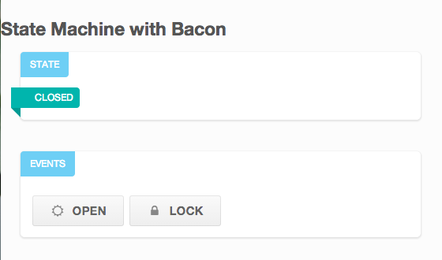
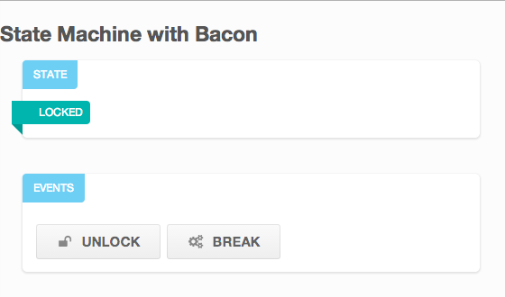
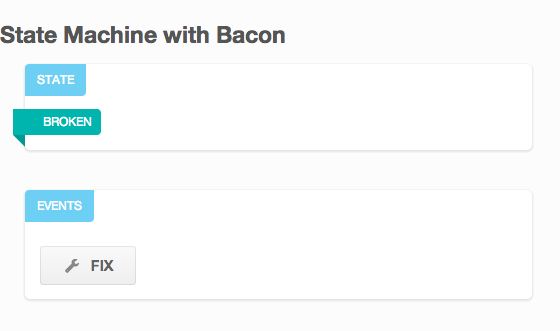
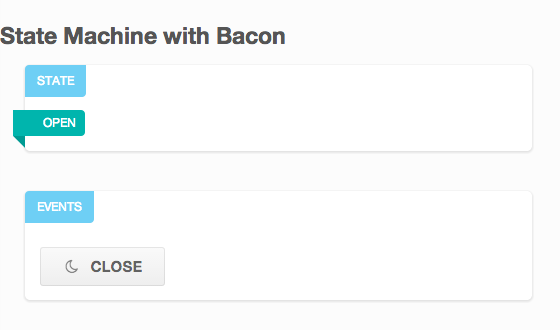

## Reactive State Machine with RxJs

We are showing how interacting with a state machine can be greatly simplified using reactive concepts. We are using
Stately.js to create a simple Door representation with 4 states and the following transitions:

     var door = Stately.machine({
         'CLOSED': {
             'open':   /* => */ 'OPEN',
             'lock':   /* => */ 'LOCKED'
         },
         'OPEN': {
             'close':  /* => */ 'CLOSED'
         },
         'LOCKED': {
             'unlock': /* => */ 'CLOSED',
             'break':  /* => */ 'BROKEN'
         },
         'BROKEN': {
             'fix':  /* => */ 'OPEN'
         }
     });

 
 

The filtering and conversion from UI events to application events (understood by the state machine) is done in a separate layer to
avoid mixing unrelated concerns.

    function click(selector){
        return Rx.DOM.fromEvent(document.querySelector(selector), 'click');
    }

    var view = {
        render: function(data) {
            ...
        },
        onEvent: function() {
            return click("#events").map(function(ev) {
                var text = ev.target.text || ev.target.parentNode.text
                return text.toLocaleLowerCase().trim();
            });
        }
    };

The incoming events are pushed to an RxObservable. Whenever an event occurs, it is applied to the current state
using _scan_ and the view is rendered.
Even though we are not doing it here, it may make sense to handle the rendering using another event stream.

    var transition = function (door, event) {
        console.log(door.getMachineState(), '->', event)
        return door[event]()
    }

    var doorStatus = function (door) {
        return {
            'state': door.getMachineState(),
            'events': door.getMachineEvents()
        }
    }

    var events = Rx.Observable.return('close').concat(view.onEvent());

    events.scan(door, transition).map(doorStatus)
        .subscribe(function (value) {
            view.render(value);
        });

Stately.js manages state in an object-oriented manner, but exposes a fluent API where each transition method returns
the state machine itself. This allows a more functional implementation, where the state is represented by a second
stream:

    Rx.Observable.return(door).combineLatest(events, transition).map(doorStatus)
        .subscribe(function (value) {
            view.render(value)
        });

In a more DCI-like implementation we could just store state in this property and
make the event stream publish transition functions (similar to the _become_ feature in Akka actors.)

With this approach testing is also simplified, as we can create sequences of synthetic events and just watch the
browser run in front of our eyes:

    var events = Rx.Observable.return('close').delay(1000).concat(Rx.Observable.return('lock').delay(1000)
        .concat(Rx.Observable.return('unlock').delay(1000).concat(Rx.Observable.return('open').delay(1000))))
        .concat(view.onEvent());

Finally, we could use _flatMapLatest_ and _takeUntil_ to change the behavior of an event stream (in a similar way the drag and drop
example is implemented), so we could implement state machines without additional libraries.